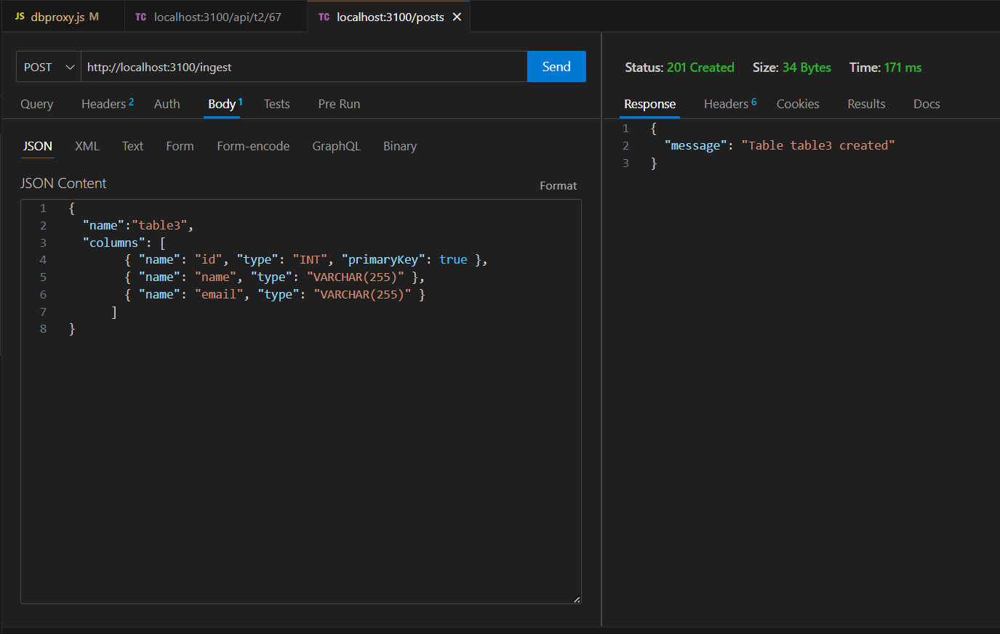
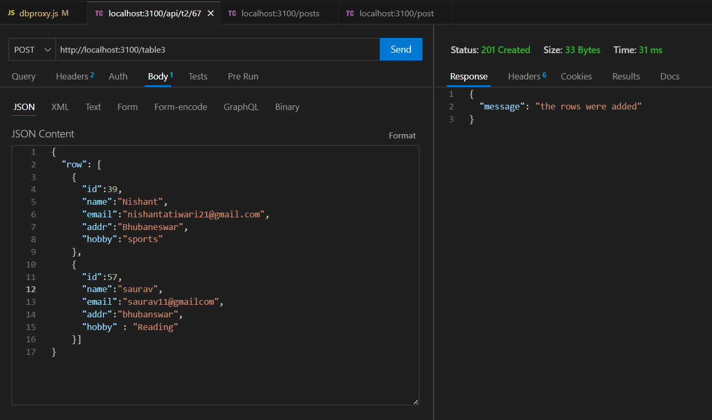
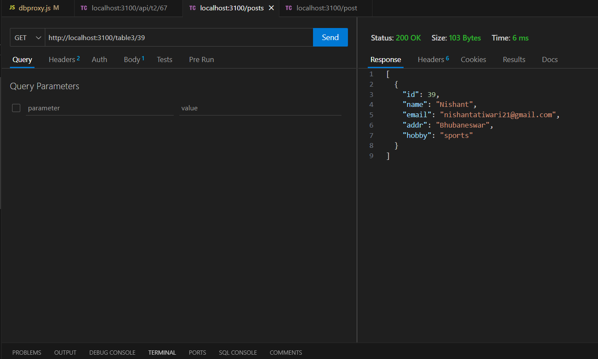
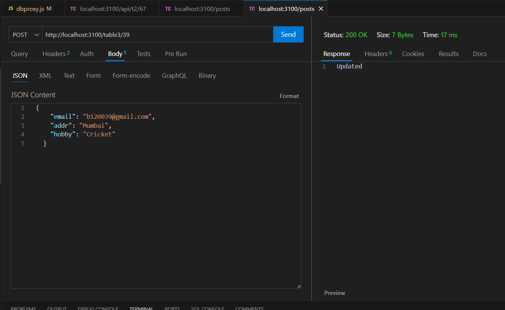
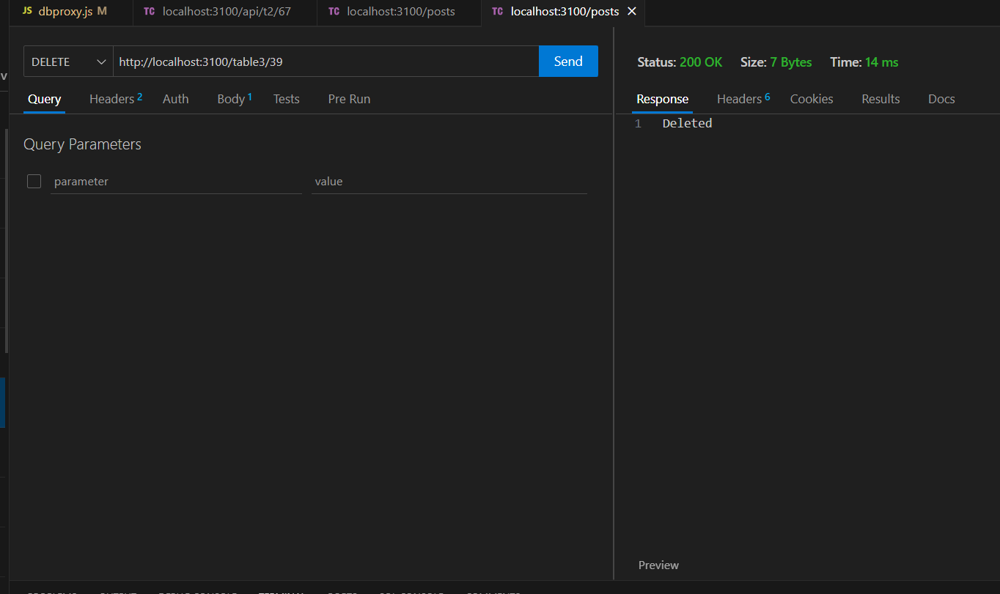

# Project Name: Generic Database Proxy - REST API for CRUD on a SQL Database
### Description
This project implements a generic database proxy that serves as a REST API for performing CRUD (Create, Read, Update, Delete) operations on a SQL database. The API translates RESTful requests into valid SQL statements, allowing users to interact with the database using HTTP requests.

The project is written in Node.js and utilizes the Express server framework. The SQL flavor used is MySQL. The proxy ingests schema files in JSON format to build the database schema on every server startup, as the initial schema may not be known in advance.

Furthermore, during the Create(i.e. POST) request, it will look for the availability and then if the column doesn't exist, it will create/add that column in the database and insert the provided values.


### Prerequisites
- Node.js installed.
- MySQL instance set up locally.
- RESTful API concepts.
### Setup and Usage :
#### Run Locally :

Clone the project

```bash
  git clone https://github.com/Nishant3231/db_proxy_CRUD
```

Go to the project directory

```bash
  cd my-project
```

Install dependencies

```bash
  npm install
```

Start the server

```bash
  npm start
```
Access the API using the defined endpoints and perform CRUD operations on the database.

### Configuration
Update the index.js file to configure the MySQL instance details, such as host, port, username, password, and database name.

### Schema Ingestion
Place the schema files in the schema directory in JSON format. The proxy will ingest these files to initialize the database schema upon server startup.
#### Example :
Passing a JSON for the database proxy to ingest the schema : 

```http
POST /ingest/:table
```

```JSON
  {
  "name":"table3",
  "columns": [
        { "name": "id", "type": "INT", "primaryKey": true },
        { "name": "name", "type": "VARCHAR(255)" },
        { "name": "email", "type": "VARCHAR(255)" }
      ]
}
```


### Features
Translate REST language into valid SQL statements using API endpoint handlers
Utilize Express server framework for handling API requests
Ingest schema files (JSON) to dynamically build the database schema
Implement CRUD operations through the following HTTP endpoints:
#### Create: 
```http
POST /:table
```
#### Read: 
```http
GET /:table/:id
```
#### Update: 
```http
POST /:table/:id
```
#### Delete: 
```http
DELETE /:table/:id
```
- Replace :table with the desired table name and :id with the specific record ID.
- Check for table existence and create/add columns based on the example schema.
- Used a local MySQL instance as the underlying database.

### Technologies Used
- JavaScript
- Node.js
- Express
- MySQL
- Postman


## Screenshots

### Examples :
- Ingesting Schema :


- POST request :


- GET request :


- UPDATE request :


- DELETE request :

